### 配置无人值守安装iso的过程并在Virtual Box中完成自动化安装

首先到该网站：https://releases.ubuntu.com/20.04/?_ga=2.173640228.608551553.1615713687-1954741177.1615604874，下载ubuntu 20.04

创建虚拟电脑，设置名称为ub20.04-young，并选择好类型版本

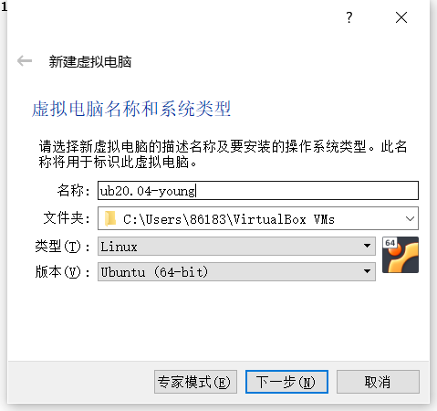

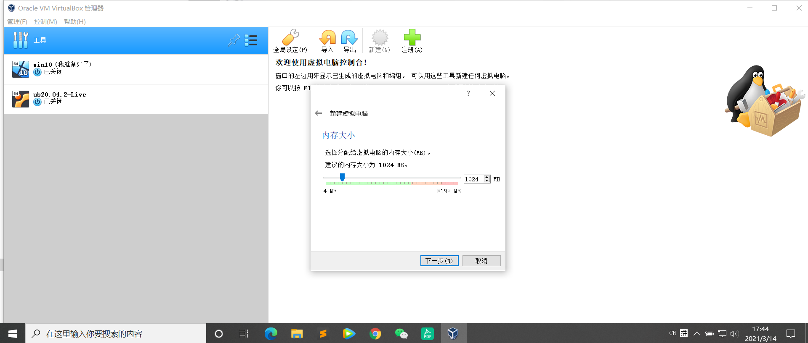

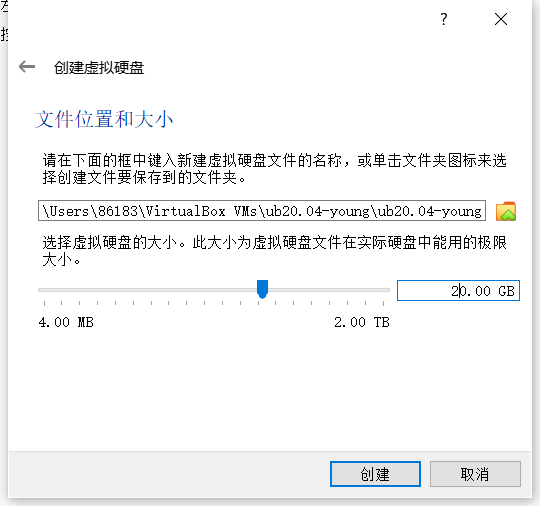

创建的虚拟机如图所示：

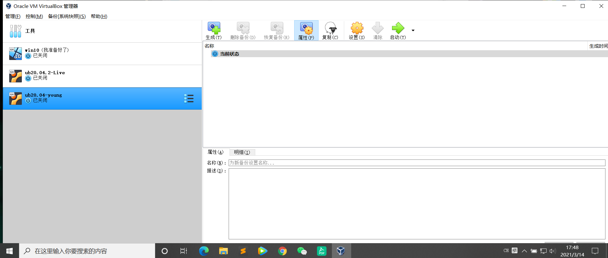

在设置界面选择网络，将网卡1，网卡2分别调制如下（NAT，主机host-only）：

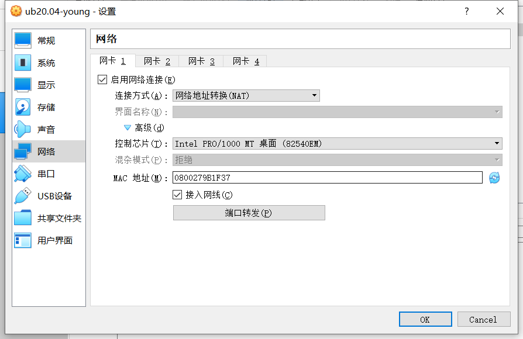

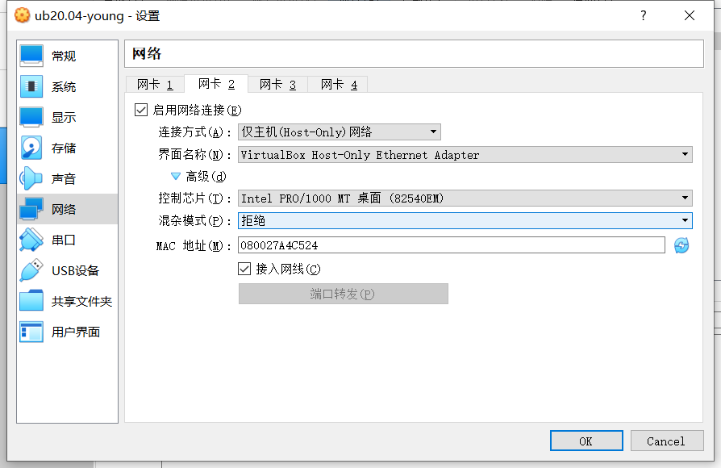

之后，在设置页面的存储中分配光驱处红圈处，导入之前就已经下好的iso文件：Ubuntu 20.04 live-server amd64.iso

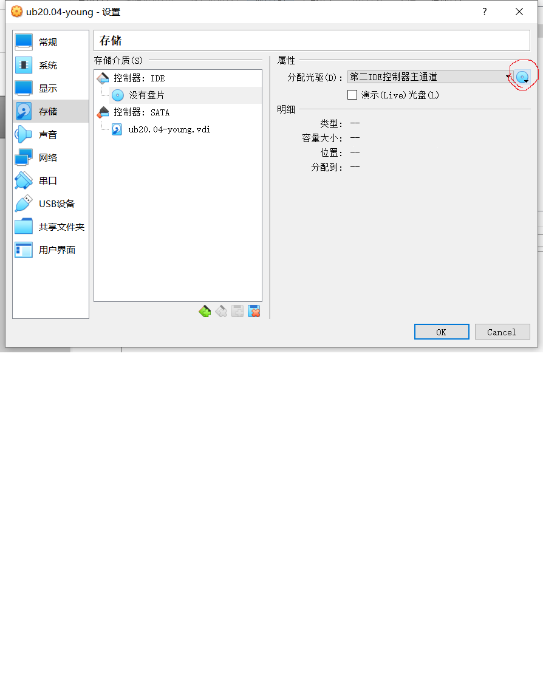

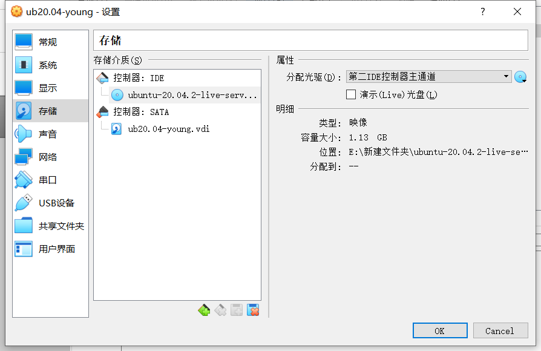

操作完成之后，启动虚拟机，运行过程如下：

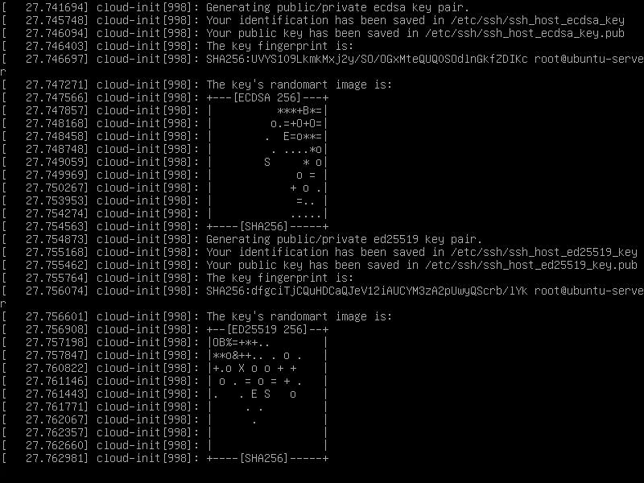

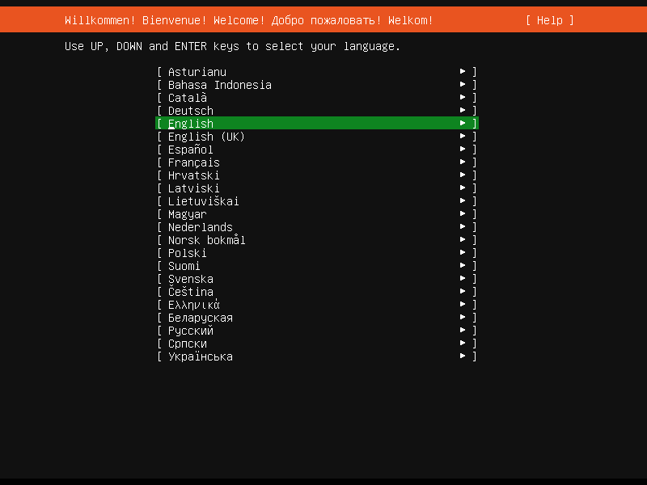

记得自己记下自己的用户名以及密码

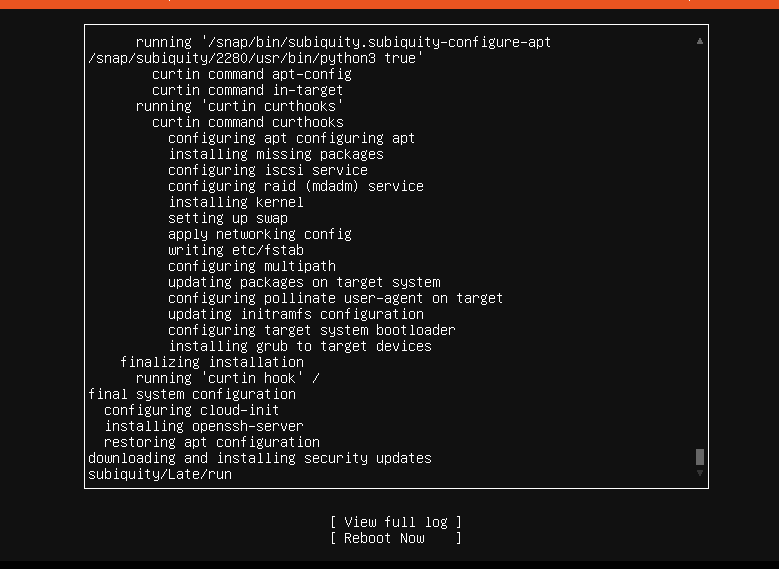

接着移除上述虚拟机设置-存储的控制器IDE，再在控制器：SATA下新建两个虚拟光盘按顺序挂在Ubuntu 20.04 live-server amd64.iso，再挂载init.iso

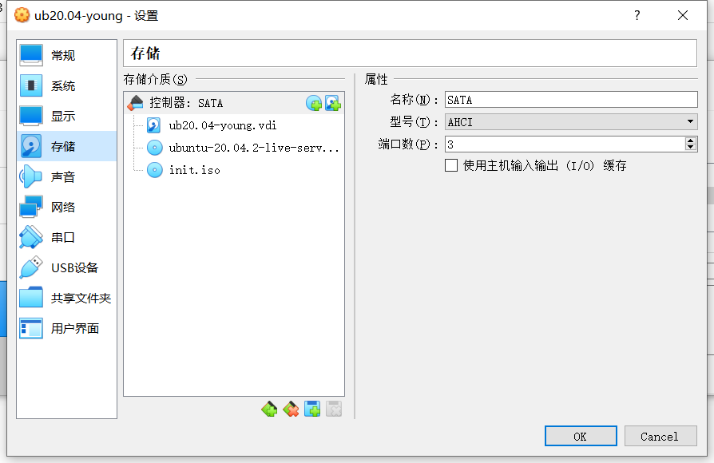
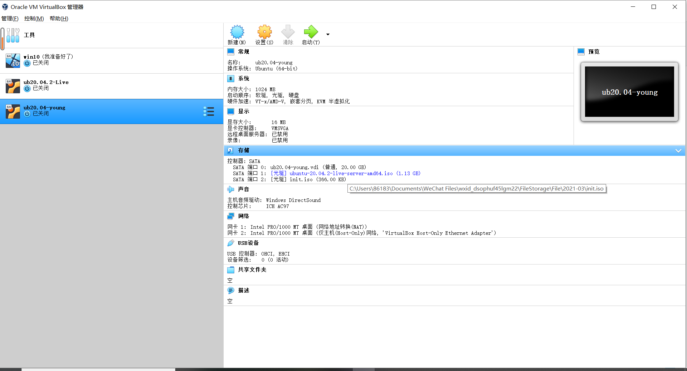

运行虚拟机，得到如下指令：
 
 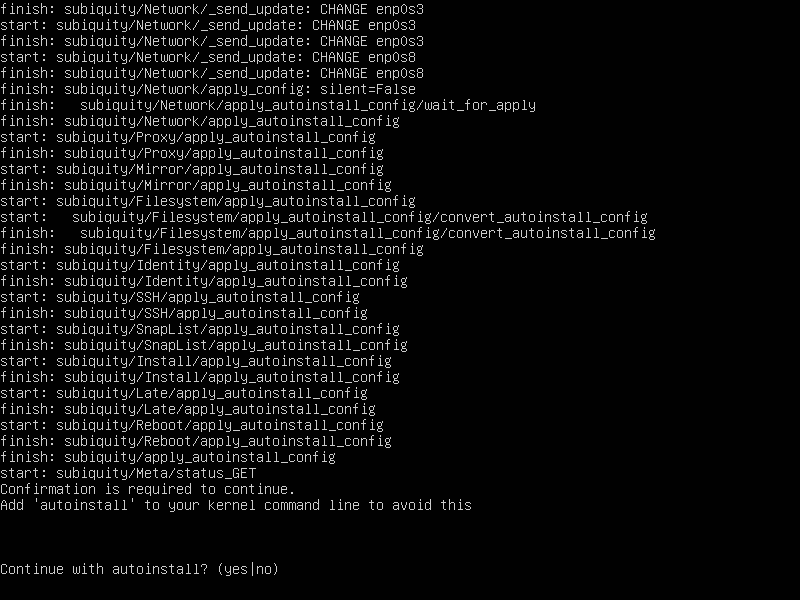

 选择yes

  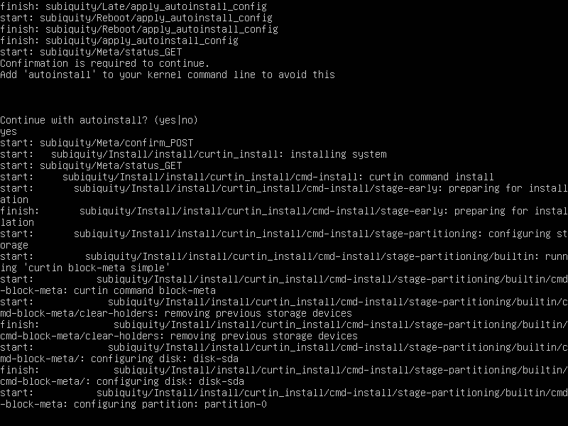